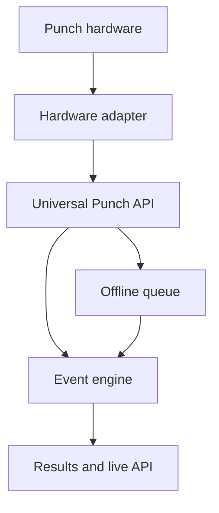

# OpenPunch Platform

OpenPunch is an open, offline-first platform for electronic punching, timing,
and results across ARDF, orienteering, rogaining, trail, and adventure races.

The platform is not tied to one organiser, country, event format, or hardware
vendor. CHUMPHON ARDF 2026 is the first planned reference deployment, not a
hard-coded product boundary.

## Principles

- Offline operation is mandatory; connectivity is an enhancement.
- Punch data can travel on a tag, from a station, or through both paths.
- Hardware connects through adapters and a stable protocol.
- Competition rules are configuration, not application code.
- Organisers may self-host the complete system.
- Auditability and recoverability take priority over flashy live features.

## Architecture



## Initial hardware profiles

| Profile | Operation | Intended use |
|---|---|---|
| Sportiduino | Tag-first, offline | Low-power field controls |
| ESP32 NFC | Station-first or hybrid | Connected and live events |
| Android NFC | Mobile reader | Registration, finish, and recovery |
| USB master | Desktop reader | Finish desk and administration |

Sportiduino is the first compatibility target. OpenPunch is not a fork or
replacement for Sportiduino; it provides an event platform and interoperability
layer around compatible field hardware.

## Repository layout

```text
apps/                 Future operator and participant applications
docs/                 Architecture and protocol documentation
packages/             Future reusable services and libraries
presets/              Event-rule configurations
schemas/              Machine-readable interchange schemas
adapters/sportiduino/ Sportiduino integration boundary
```

## Project status

Architecture and protocol definition. No production release yet.

## Reference deployment

CHUMPHON ARDF 2026, organised by HS8AC in Chumphon, Thailand, is planned as
the first field deployment. Event-specific rules remain in presets and do not
belong in the platform core.

## Attribution

Project initiated by E25XLD / HS8AC with community contributors.

Sportiduino is an independent GPL-3.0 open-source project. Its name and source
remain attributed to its original authors. Any copied or modified Sportiduino
code must retain its applicable licence and notices.

## Licence

Documentation and original OpenPunch code are intended to be released under
Apache-2.0. Components derived from GPL-3.0 software remain GPL-3.0 and must be
kept in clearly identified boundaries. A formal licence review is required
before the first software release.
